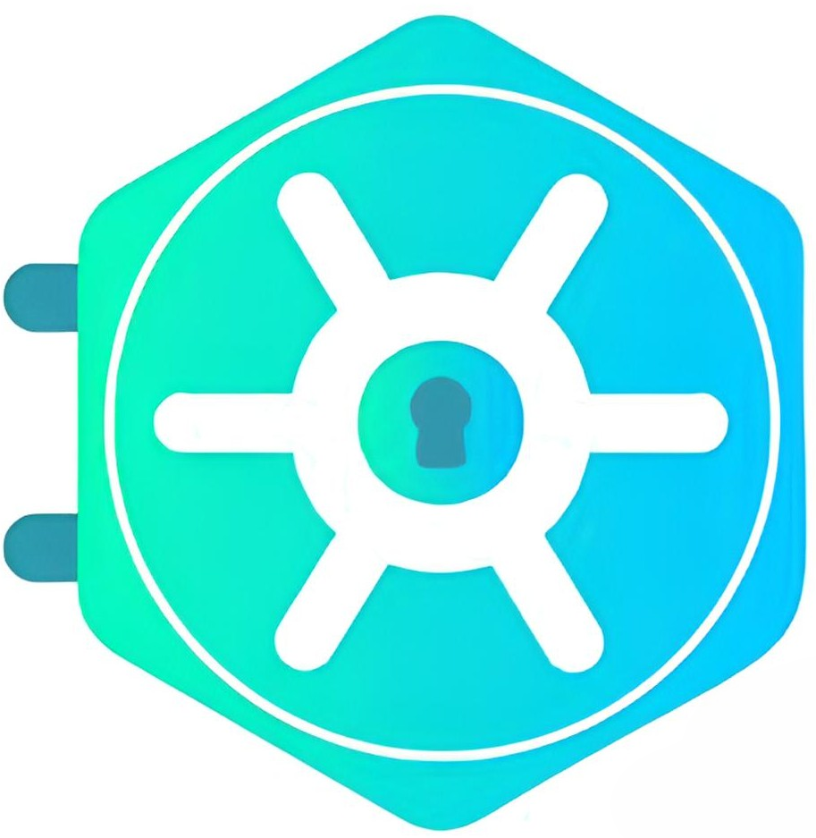

# My Finance - Tema de Login

<p align="center">
  
  <h1 align="center">My Finance - Sistema de Controle Financeiro Pessoal</h1>
</p>

<p align="center">
    <i>💰 Desenvolvido com <a href="https://keycloakify.dev">Keycloakify</a>, React, TypeScript e TailwindCSS 💰</i>
    <br/>
</p>

---

## 📋 Visão Geral

Este repositório contém o tema de login personalizado para **My Finance**, um sistema completo de controle financeiro pessoal desenvolvido com Keycloakify. O tema possui design moderno, responsivo e focado em usabilidade, cobrindo todos os fluxos de autenticação do Keycloak.

---

## ✅ Status do Projeto

- **Projeto em desenvolvimento!**
- **Data:** Janeiro 2025
- **Status:** 🚧 EM DESENVOLVIMENTO
- **Versão:** 1.0.0

### 🎯 Funcionalidades Planejadas
- ✅ Sistema de autenticação seguro
- 🚧 Dashboard financeiro
- 🚧 Controle de receitas e despesas
- 🚧 Categorização de transações
- 🚧 Relatórios e gráficos
- 🚧 Metas financeiras
- 🚧 Backup e sincronização

---

## 📝 Pré-requisitos
- Node.js 18+ ou 20+
- Docker e Docker Compose
- Git

---

## ⚙️ Instalação e Setup Local

```bash
# 1. Clone o repositório
git clone https://github.com/danielcouto/my-finance-login.git
cd my-finance-login

# 2. Instale as dependências
yarn install

# 3. Inicie o Storybook para desenvolvimento visual
yarn storybook
```
O Storybook abrirá em `http://localhost:6006` para visualização e desenvolvimento dos componentes.

---

## 🚀 Build & Deploy do Tema

### Gerar o arquivo do tema
```bash
yarn build-keycloak-theme
```
Os arquivos `.jar` serão criados em `dist_keycloak/`.

### Deploy com Docker (Recomendado)
```bash
# Construir e iniciar todos os serviços
docker-compose up -d

# Verificar logs
docker-compose logs -f

# Acessar Keycloak
# URL: http://localhost:8080
# Admin: admin / admin123
```

---

## 🗂️ Estrutura do Projeto
- `src/login/`: Componentes React (`.tsx`) para cada página de login
- `public/`: Assets públicos, como logo
- `tailwind.config.js`: Configuração do TailwindCSS
- `KcContext.ts`: Tipos do contexto Keycloak
- `dist_keycloak/`: Arquivos `.jar` gerados para deploy

---

## 🌍 Internacionalização (i18n)

O projeto possui suporte completo à internacionalização via Keycloak. Utilize a função `msgStr()` para textos dinâmicos e traduções. Para adicionar novos idiomas, configure pelo console do Keycloak em **Realm Settings > Localization**.

### Exemplo de uso em React
```tsx
const { msgStr } = kcContext;
<h1>{msgStr("welcomeTitle")}</h1>
```

---

## 🧪 Testes e Qualidade

- **Unitários:** Vitest + Testing Library
- **Componentes:** Storybook
- **Cobertura mínima:** 80%
- **Testes críticos:** 100%

### Comandos úteis
```bash
npm run test             # Executa testes
npm run test:watch       # Modo watch
npm run test:coverage    # Cobertura
npm run lint             # ESLint
npm run format           # Prettier
npm run type-check       # TypeScript check
```

---

## 🎨 Design System

### Conceito Visual
- **Glassmorphism:** Efeito de vidro fosco com transparências sutis
- **Gradientes Modernos:** Azul → Verde para elementos principais
- **Céu Estrelado:** Background animado com estrelas pulsantes
- **Minimalismo:** Interface limpa e focada na usabilidade

### Paleta de Cores
- **Primária:** Azul moderno (#0EA5E9) → Verde (#10B981)
- **Secundária:** Roxo acento (#A855F7)
- **Glassmorphism:** Transparências e blur effects
- **Neutros:** Tons de cinza escuro para contraste

### Tipografia
- **Fonte Principal:** Inter (moderna e legível)
- **Hierarquia:** Sistema de tamanhos bem definido
- **Peso:** Variação de pesos para hierarquia visual

### Componentes
- **Botões:** Gradientes e efeitos hover suaves
- **Inputs:** Glassmorphism com ícones integrados
- **Cards:** Backdrop blur e bordas translúcidas
- **Animações:** Transições suaves e micro-interações

---

## 🚧 Roadmap

### Fase 1 - Autenticação (Atual)
- ✅ Tema de login personalizado
- ✅ Sistema de registro
- ✅ Recuperação de senha
- ✅ Verificação de email

### Fase 2 - Dashboard (Próxima)
- 🚧 Dashboard principal
- 🚧 Visão geral financeira
- 🚧 Widgets de resumo

### Fase 3 - Transações
- 🚧 Cadastro de receitas/despesas
- 🚧 Categorização
- 🚧 Importação de extratos

### Fase 4 - Relatórios
- 🚧 Gráficos e análises
- 🚧 Relatórios mensais/anuais
- 🚧 Exportação de dados

### Fase 5 - Metas e Planejamento
- 🚧 Definição de metas
- 🚧 Planejamento orçamentário
- 🚧 Alertas e notificações

---

## 🆘 Troubleshooting (Soluções de Problemas)

### Porta 8080 ocupada
```bash
netstat -ano | findstr :8080
# Parar serviços conflitantes
docker-compose down
```

### Container não inicia
```bash
docker-compose logs keycloak
docker-compose down
docker-compose up -d --build
```

---

## 🧰 Comandos Úteis
```bash
docker-compose ps                # Ver status dos containers
docker-compose logs -f           # Ver logs em tempo real
docker-compose down              # Parar todos os serviços
docker-compose restart           # Reiniciar serviços
npm run build-keycloak-theme     # Build do tema
npm run storybook                # Storybook
npm run dev                      # Vite dev server
```

---

## 👤 Autor
Desenvolvido por **Daniel Couto**

<p align="center">
  <b>Transformando o controle financeiro pessoal! 💰</b>
</p>
